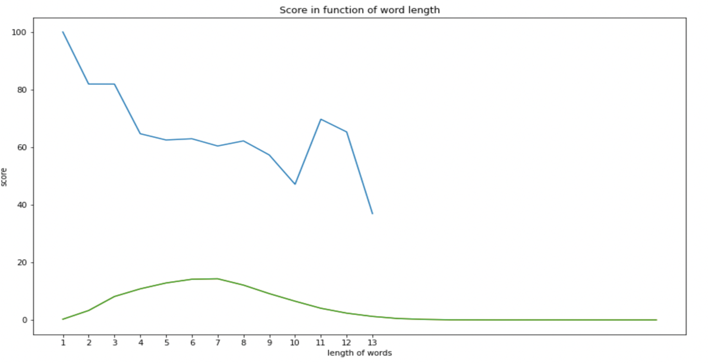
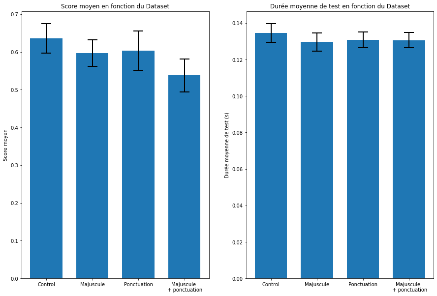

# Pygmalion

Outil d’auto-complétion d’emails par intelligence artificielle

Promotion		Octobre 2021 Continue DS

Participants :

* Nicolas PONLET (NP), 36 ans, ingénieur informaticien, 8 années d’expérience dans le secteur des banques et assurances
* Adrien SENECAL (AS), 37 ans, Docteur en Biologie Moléculaire. 10 années d’expérience comme chercheur à l’Ecole Normale Supérieure (Paris) et Albert Einstein College Institute (New York).
* Patrick HUTTER (PH) 61 ans, Ingénieur Arts & Métiers. 35 années d’expérience industrielle comme Directeur Industriel et Directeur R&D dans différents groupes internationaux et PMI.

## Modèle GPT2 pré-entrainé
Les fichiers de sauvegardes du meilleur modèle présenté dans ce rapport ne sont pas fournis dans Github à cause de leurs tailles trop volumineuse. Vous pourrez télécharger une version compressé sur [Google Drive](https://drive.google.com/file/d/1DIHT_4Q1cbRDWzVgU26U9bXaABbSfWtG/view?usp=sharing).

## Introduction

Quelques mots en introduction de ce rapport d’évaluation quant au choix du nom de ce projet : Pygmalion. Ce nom nous vient du récit d’Ovide, dans les métamorphoses, d’une légende de la mythologie grecque relatant l’histoire d’un sculpteur, Pygmalion, qui tomba amoureux de la statue qu’il a façonnée, Galatée. C’est surtout la première histoire de l’humanité qui décrit une création de l’homme qui devient vivante et dotée d’une intelligence.

Ce mythe de Pygmalion a été repris au XIXe siècle par Georges Shaw dans une pièce de théâtre qui décrit le processus d’apprentissage d’une personne sans éducation en une personne cultivée grâce à un linguiste. Pygmalion illustre, de fait, assez bien ce que nous souhaitons réaliser dans ce projet, construire un modèle capable de générer des mots à partir d’un corpus donné, mots générés en fonction du contexte.

[https://www.theatre-classique.fr/pages/pdf/OVIDE_METAMORPHOSES_10.pdf](https://www.theatre-classique.fr/pages/pdf/OVIDE_METAMORPHOSES_10.pdf)

[http://www.kkoworld.com/kitablar/Bernard_Shaw_Secilmis_eserler_eng.pdf](https://www.theatre-classique.fr/pages/pdf/OVIDE_METAMORPHOSES_10.pdf)

Nous souhaitons également en cette introduction remercier notre mentor Laurene pour son aide, ses conseils, sa capacité à nous proposer des pistes à explorer sans chercher à nous imposer des solutions. Merci pour ce travail collaboratif intelligent tout au long de ce projet.

## Contexte

### Contexte d’insertion du projet et perspective métier

Venant d’horizons professionnels biens différents, ce projet nous a cependant réunis autour d’une problématique commune : le Natural Language Processing (NLP) grâce au deep learning.

Une même problématique pour des applications différentes, c’est une des caractéristiques des techniques de la data-science qui trouvent des applications dans tous les domaines d’activités.

#### Applications dans le domaine industriel

Dans le domaine industriel par exemple, un point clé des processus d’amélioration continue sont les retours d’expériences, comptes-rendus d’activités, rapports d’essais. 

Malheureusement ces documents sont souvent rédigés de manières approximatives et incomplètes par des opérateurs de moins en moins en mesure de décrire avec précision les faits relevés soit par manque de temps, soit en raison d’environnements peu favorables à la rédaction et à l’analyse. 

S’ajoute également le fait que les entreprises interviennent sur les 5 continents et qu’il est nécessaire de pouvoir traduire les documents générés idéalement au fil de l’eau. 

D’où le besoin de créer un outil d’aide à la description d’un problème (problème d’organisation, de processus, dépannage, recherche de causes…), idéalement multilingue.

Cet outil permet de simplifier la saisie, tout en tenant compte du contexte et du vocabulaire spécifique du domaine d’activité, ce qui permet un gain de temps dans la compréhension, l’analyse et la recherche de solutions à un problème.

Autre exemple industriel, les Interfaces Homme-Machine (IHM) qui vont évoluer du bon vieux système écran-clavier vers la réalité augmentée, l’internet des objets (IOT) et une communication en langage naturel (soit oral, soit écrit) entre l’homme et la machine. Des premiers exemples d’interactions par échanges de courriels entre l’homme et la machine ont d’ailleurs déjà été réalisés par la société OPTIMData entre autres. Les techniques du NLP/NLU sont des briques de plus en plus importantes pour les développements à venir.

Les avantages économiques sont importants, accès immédiat à l’information, plus de temps perdu à naviguer entre les menus, réduction du temps de formation…

#### Applications dans le domaine technique

La création de tels outils s’appuie sur les techniques suivantes qu’on peut regrouper sous le nom de NLP :

1. Text mining

Le text mining nous permet de filtrer, extraire, traiter, remplacer les données d’un texte brut en données exploitables. Nous le verrons plus tard, mais il s’agit là d’une étape primordiale, le nettoyage des données de notre dataset a clairement impacté la performance de notre modèle.

2. Tokenisation et vectorisation

L’opération de tokenisation permet le découpage du texte, comme son nom l’indique, en tokens. Ces tokens peuvent être des phrases, des mots ou des parties de mots, qui seront ensuite transformés en nombres par la vectorisation pour pouvoir être traités au sein de tenseurs.

3. Modèle Seq2Seq, word embedding, Word2vec-CBOW, et mécanismes d’attention
* Un modèle Seq2seq est un modèle qui prend en entrée une séquence d’éléments (mots, lettres) et qui renvoie une autre séquence d’éléments. Ce modèle s’applique particulièrement bien à la traduction automatique. Nous allons l’appliquer à la problématique de l’auto-complétion.
* Le word embedding est capable en réduisant la dimension de la matrice d’embedding de capturer le contexte, la similarité sémantique et syntaxique (genre, synonymes, ...) d'un mot
* L’algorithme Word2vec permet d’entraîner la matrice d’embedding avec notre corpus.
* Dans l'architecture continuous bag-of-words (CBOW), le modèle prédit le mot courant à partir d'une fenêtre de mots contextuels environnants. L'ordre des mots de contexte n'influence pas la prédiction (hypothèse du sac de mots).
* Le mécanisme d’attention permet d’ajouter une pondération en fonction de l’importance des mots d’une séquence.

4. Transformers, modèle de langage

Les transformers sont un concept défini dans le document « [Attention is all you need](https://papers.nips.cc/paper/2017/hash/3f5ee243547dee91fbd053c1c4a845aa-Abstract.html) », il est basé sur un modèle seq2seq n’utilisant que les mécanismes d’attention.

Le modèle de langage est un modèle statistique déterminant la probabilité de séquence des mots dans une langue donnée. Ceci permet d’ajouter des informations complémentaires au transformer pour en augmenter la performance.

#### Applications dans le domaine scientifique

D’un point de vue scientifique, le langage est connu pour être au cœur de l’élaboration des sociétés humaines. Il permet d’échanger des idées et donc de comprendre et se faire comprendre par autrui, prérequis fondamental pour la vie en communauté. 

Par ailleurs, le langage est également central dans le développement du cerveau. En effet, nous pensons dans la langue que nous parlons. Les langues peuvent donc influencer notre façon de penser, suivant la structure de celles-ci. 

Pour ces deux raisons prises en exemple, le développement des outils liés au NLP peut contribuer à l’étude de l’impact du langage dans le développement des sociétés humaines. La capacité d'emmagasiner un très grand nombre d’informations, d’en extraire les structures pour les mettre en relation, peut constituer un enjeu majeur pour pousser la recherche scientifique dans des directions encore inexplorées.

### Contexte initial en terme d’objectifs du projet et d'expérience du groupe

#### Objectifs

Dans le cadre de ce projet, nous nous efforcerons de construire un modèle capable de prédire un mot en fonction de son contexte. Le contexte sera déterminé de façon élémentaire dans un premier temps, sur la base d’une approche par occurrence des mots tirés d’un corpus. Puis de façon plus complexe, à l’aide d’outils statistiques utilisés en deep learning pour les questions de NLP. 

Pour évaluer la performance de nos modèles, nous réfléchirons à une métrique permettant de répondre spécifiquement à notre problématique.

#### Expérience

Aucun des membres du groupe n’avait d’expérience dans le domaine du NLP. D’où l’importance d’appréhender ce projet avec différentes approches, en comprendre les limites et découvrir au fur et à mesure de nouveaux outils permettant de lever les problématiques. 

Nous avons été guidés dans ce projet par notre mentor Laurène, qui a su nous orienter, étape par étape, vers des techniques de plus en plus pertinentes pour construire notre modèle. Nous sommes partis sur la base d’une approche simple d’auto-complétion uniquement basée sur une analyse fréquentielle des lettres et mots pour évoluer vers des techniques plus élaborées de deep learning et de transformers.

Nos seules ressources ont été les documents que nous avons pu trouver sur Internet, dont les références sont listées ci-dessous.

Nous n’avions pas connaissance de projets similaires dans nos entreprises ou entourages respectifs. Il semblerait qu’aucun projet d’auto-complétion n’ait encore été fait dans le cadre de cette formation de Data Scientist.

## Data

### Cadre

#### Jeux de données

Nous avons démarré ce projet par l’étude de différents datasets pour générer notre corpus.

* [Les e-mails d'Hillary Clinton](https://www.kaggle.com/datasets/kaggle/hillary-clinton-emails) lors de sa mission de Secrétaire d’Etat en 2015
* [Les e-mails de la société ENRON](https://www.cs.cmu.edu/~./enron/) 

Le dataset retenu a été finalement celui de la société ENRON, plus riche en contenu et plus proche du monde industriel.

Cependant il est intéressant de noter qu’à tout moment il serait possible de remplacer le dataset par un autre. Il serait intéressant, par la suite, de comparer la performance de notre modèle avec un autre dataset pour mesurer sa robustesse.

Principales caractéristiques du jeu de données ENRON :

* Environ 500 000 mails échangés entre 158 collaborateurs du groupe (cadres supérieurs principalement)
* Libre d’accès et de droit, suite à la faillite du groupe en 2001.
* Répond à une problématique d’entreprise appartenant à un domaine d’activité bien précis qu'est l'énergie.
* [https://www.cs.cmu.edu/~./enron/](https://www.cs.cmu.edu/~./enron/)

_Figure 1. Top 20 des sujets d’emails_

On y retrouve les centres d'intérêts classiques d'un grand groupe industriel

* **Communication** : Enron mentions, EnTouche Newsletter, William Energy New Live
* **Organisation du groupe** : Organization(al) Announcement
* **Résultats et évaluation des bonus** : Mid-year perf feedback, year end Perf. feedback
* **Indicateurs**: energy issues, power indices, gas indices
* Plus spécifique à Enron, le mail à Ken Lay (CEO d'Enron) envoyé par plus de 1124 employés suite à la faillite du groupe, demandant le versement des profits réalisés par Ken Lay lors de la vente d'actions d'Enron juste avant que la faillite du groupe Enron ne soit rendue publique.
* Enfin le suivi automatique de congestion du réseau électrique en Californie appelé HourAhead(Schedule crawler: HourAhead Failure).

_Figure 2. Top 15 des mots les plus fréquents des sujets d’emails_

La liste des mots les plus fréquents permet également de synthétiser les axes prioritaires de l'activité des employés d'Enron. En première place on retrouve logiquement le nom de la société Enron, suivi du mal des grandes sociétés : les réunions. Les mots suivants décrivent bien l'activité du groupe (energy, gas) et le système de pilotage en énergie de la Californie (HourAhead + codesite)

#### Analyse et visualisation des données

1. Mots les plus utilisés/fréquents

Une première analyse du dataset ENRON nous donne les volumétries suivantes

* 497560 mails, 
* 135 millions de mots 

Après nettoyage du dataset, il reste un corpus de 303752 mots distincts.

Nous avons représenté sous forme d’un Wordcloud, une vue synthétique des mots les plus fréquents du dataset, après filtrage des stop words (mots inutiles).

_Figure 3. Word cloud des mots les plus fréquents_

La distribution par fréquence d’apparition des mots dans les mails est la suivante

_Figure 4. Distribution des 20 mots les plus fréquents avec et sans stop-words._

* Peu de mots se retrouvent très représentés, puis les occurrences diminuent progressivement. 
* Pour exploiter l’occurrence des mots dans un outil d’auto-complétion, il va falloir ajouter un contexte, comme par exemple la famille du mot qui précède celui que l’on souhaite prédire.

2. Fréquence et ordre des lettres

Les lettres qui composent les mots de la langue Anglaise ne sont pas tirées au hasard. Une approche très naïve de notre problème d’auto-complétions d’emails pourrait être de simplement prédire la lettre suivante en fonction de celle en cours.

Nous pensons que si l’utilisateur tape une lettre donnée (E par exemple), il y a plus de chances de suivre par certaines lettres spécifiques que par d’autres. Le type de lettre (voyelle ou consonne) peut également jouer un rôle prédictif important.

_Figure 5. Type de lettre suivante_

_Figure 6. Matrice de distribution des lettres_

On voit que les lettres ont tendance à s’alterner : les voyelles sont souvent suivies de consonnes et vice-versa. La lettre E est la plus représentée, la lettre Q est très souvent suivie par un U. Il est toutefois difficile de savoir comment ces associations pourraient nous aider directement dans l’élaboration d’un modèle d’auto-complétions efficace.

3. Nombre v/s diversité des mots et taille des mails

Nous avons un dataset très grand (plus de 500 000 emails et 135 millions de mots) et le nombre de mot indépendant est très grand aussi (presque 300 000). La langue Anglaise contient plus de 1 million de mots au total, environ 170 000 mots en usage courant et 20 000 à 30 000 mots utilisés par chaque personne.

On pourrait simplifier ce dataset et n’utiliser qu’une partie des mots pour notre apprentissage. En utilisant seulement les mots les plus utilisés, on pourrait conserver une part significative de l’information tout en réduisant drastiquement les temps de calculs.

_Figure 7. Réduction du dataset_

En utilisant seulement les mots les plus utilisés, on récupère une grande partie de l'information tout en réduisant drastiquement la taille du dataset. Par exemple, en utilisant les 5472 mots les plus utilisés, on récupère 90% de l'information avec seulement 1.85% de la taille du dataset.

4. Fréquence et diversité des natures de mots (tag)

La nature des mots est un élément important pour identifier et connaître la place des mots dans une phrase. Par nature des mots (tag) on entend, le classement des mots dans les catégories suivantes :

* Pronoms : PRP
* Déterminants : DT
* Noms : NN
* Verbes : VB
* Adjectifs : JJ
* Conjonctions : IN
* ...

37 catégories sont définies dans le package averaged_perceptron_tagger de NLTK

_Figure 8. Distribution par type de mots_

Il reste à affiner le filtrage des mots pour obtenir un dataframe plus propre, en particulier il reste beaucoup de lettres isolées dans le dataframe qu’il faudrait éliminer.

Cependant on peut dès à présent, à la vue des résultats obtenus établir les mots les plus fréquents par catégories

* NN : Enron, ECT, please, power, energy, mail, message, gas, company, market, information
* JJ : new, other, original, last, first, next, free, financial, good
* NNS : thanks, questions, services, prices, companies, issues, customers, communications, comments
* VBP : have, are, am, do, use, think, go, take, change
* VBD : was, said, forwarded, were, had, did, put asked, updated, got, proposed, told, provided

### Pertinence

#### Prétraitement des données

Après cette première phase de visualisation des données, et avant de chercher à construire un modèle, il est fondamental de s’assurer de la pertinence et de la qualité des données de notre dataset.

Après avoir chargé le corps des mails du dataset, nous avons nettoyé les données à l’aide d’une chaîne d’instruction utilisant les Regex :

* Transformation des caractères majuscules en minuscules
* Insertion d’une espace devant les caractères ?!, ¿ 
* Remplacement des caractères différents de A-Z,a-z,0-9,., ?, !,, par une espace
* Suppression des espaces multiples par une seule
* Remplacement des formes de verbes contractés par leur forme complète (par ex. won’t en will not)
* Élimination de tout ce qui précède  le mot «Subject: », afin de supprimer le contenu qui précède une réponse ou un transfert.
* Découpage de chaque email en phrase (chaîne de caractère se terminant par “.”, “!”, “?”) pour que le dataset soit constitué d’une phrase par ligne.

Il reste encore des étapes de nettoyage possible pour le texte que nous n’avons pas eu le temps de faire. Par exemple, des adresses de sites web ou des tags d’images.

#### Choix des variables

La seconde étape du preprocessing est la construction de nos variables d’entrées et cibles.

La figure 9 montre le dataset une fois le prétraitement réalisé. La colonne SENTENCES correspond à une phrase du corpus d’emails. Nous avons dupliqué chacune des phrases autant de fois que de mots qu’elles contiennent, en renseignant la colonne ENTRY avec le début de la phrase selon la découpe, et la colonne PREDICTION avec le mot qui suit cette découpe.

<table>
  <tr>
   <td><strong><em>sentence</em></strong>
   </td>
   <td><strong><em>entry</em></strong>
   </td>
   <td><strong><em>prediction</em></strong>
   </td>
  </tr>
  <tr>
   <td><em>call me with any questions you may have</em>
   </td>
   <td>
   </td>
   <td><em>call</em>
   </td>
  </tr>
  <tr>
   <td><em>call me with any questions you may have</em>
   </td>
   <td><em>call</em>
   </td>
   <td><em>me</em>
   </td>
  </tr>
  <tr>
   <td><em>call me with any questions you may have</em>
   </td>
   <td><em>call me</em>
   </td>
   <td><em>with</em>
   </td>
  </tr>
  <tr>
   <td><em>call me with any questions you may have</em>
   </td>
   <td><em>call me with</em>
   </td>
   <td><em>any</em>
   </td>
  </tr>
  <tr>
   <td><em>call me with any questions you may have</em>
   </td>
   <td><em>call me with any</em>
   </td>
   <td><em>questions</em>
   </td>
  </tr>
  <tr>
   <td><em>call me with any questions you may have</em>
   </td>
   <td><em>call me with any questions</em>
   </td>
   <td><em>you</em>
   </td>
  </tr>
  <tr>
   <td><em>call me with any questions you may have</em>
   </td>
   <td><em>call me with any questions you</em>
   </td>
   <td><em>may</em>
   </td>
  </tr>
  <tr>
   <td><em>call me with any questions you may have</em>
   </td>
   <td><em>call me with any questions you may</em>
   </td>
   <td><em>have</em>
   </td>
  </tr>
</table>

_Figure 9. Dataset une fois tout le pre-processing réalisé_

La variable cible est donc le mot à prédire, en fonction des mots qui précèdent ce dernier, représentant donc la saisie de l’utilisateur ainsi que le contexte de la séquence

Pour des problématiques de NLP, la corrélation entre les mots constitue tout l’enjeu de ce domaine d’étude. En effet, c’est en développant des outils statistiques basés sur les modèles de langage, c’est-à-dire la prise en compte du contexte des mots, de la structure de leur organisation, que les performances se sont accrues. 

Le jeu de données ENRON possède un champ lexical particulier, celui du domaine industriel dans lequel cette entreprise s’inscrit, l'énergie. Par conséquent, les modèles entraînés sur ce dataset risquent d’être plus performant dans ce champ lexical particulier, au détriment de leurs généralisations.

## Projet

### Classification du problème 

Notre projet s’inscrit dans une problématique typique du NLP : la prédiction de mots en fonction du contexte. Il s'appuiera donc sur les techniques de deep learning qui lui sont associées, telles que les RNN et les transformers.

Plusieurs métriques sont possibles pour quantifier l’efficacité d’un logiciel d'auto-complétion. Il est par exemple possible de compter le nombre de mots correctement prédit, le nombre de lettres économisées ou la qualité du texte généré.

Lorsqu’un utilisateur écrit un email, il veut que le logiciel d’auto-complétions lui fasse gagner du temps. Ainsi, nous avons utilisé en score le nombre de lettres économisées, qui a l’avantage d’être proportionnel au gain de temps pour l’utilisateur.

Pour la sentence “call me with any questions”, voici les différentes possibilités de score :

<table>
  <tr>
   <td>entry
   </td>
   <td>prediction
   </td>
   <td>letter count
   </td>
   <td>user-typed letters
   </td>
   <td>score
   </td>
  </tr>
  <tr>
   <td rowspan="5" > 
   </td>
   <td rowspan="5" >call
   </td>
   <td rowspan="5" >4
   </td>
   <td>“”
   </td>
   <td>4
   </td>
  </tr>
  <tr>
   <td>“c”
   </td>
   <td>3
   </td>
  </tr>
  <tr>
   <td>“ca”
   </td>
   <td>2
   </td>
  </tr>
  <tr>
   <td>“cal”
   </td>
   <td>1
   </td>
  </tr>
  <tr>
   <td>“call”
   </td>
   <td>0
   </td>
  </tr>
  <tr>
   <td rowspan="3" >call
   </td>
   <td rowspan="3" >me
   </td>
   <td rowspan="3" >2
   </td>
   <td>“”
   </td>
   <td>2
   </td>
  </tr>
  <tr>
   <td>“m”
   </td>
   <td>1
   </td>
  </tr>
  <tr>
   <td>“me”
   </td>
   <td>0
   </td>
  </tr>
  <tr>
   <td rowspan="5" >call me
   </td>
   <td rowspan="5" >with
   </td>
   <td rowspan="5" >4
   </td>
   <td>“”
   </td>
   <td>4
   </td>
  </tr>
  <tr>
   <td>“w”
   </td>
   <td>3
   </td>
  </tr>
  <tr>
   <td>“wi”
   </td>
   <td>2
   </td>
  </tr>
  <tr>
   <td>“wit”
   </td>
   <td>1
   </td>
  </tr>
  <tr>
   <td>“with”
   </td>
   <td>0
   </td>
  </tr>
  <tr>
   <td rowspan="4" >call me with
   </td>
   <td rowspan="4" >any
   </td>
   <td rowspan="4" >3
   </td>
   <td>“”
   </td>
   <td>3
   </td>
  </tr>
  <tr>
   <td>“a”
   </td>
   <td>2
   </td>
  </tr>
  <tr>
   <td>“an”
   </td>
   <td>1
   </td>
  </tr>
  <tr>
   <td>“any”
   </td>
   <td>0
   </td>
  </tr>
  <tr>
   <td rowspan="10" >Call me with any
   </td>
   <td rowspan="10" >questions
   </td>
   <td rowspan="10" >9
   </td>
   <td>“”
   </td>
   <td>9
   </td>
  </tr>
  <tr>
   <td>“q”
   </td>
   <td>8
   </td>
  </tr>
  <tr>
   <td>“qu”
   </td>
   <td>7
   </td>
  </tr>
  <tr>
   <td>“que”
   </td>
   <td>6
   </td>
  </tr>
  <tr>
   <td>“ques”
   </td>
   <td>5
   </td>
  </tr>
  <tr>
   <td>“quest”
   </td>
   <td>4
   </td>
  </tr>
  <tr>
   <td>“questi”
   </td>
   <td>3
   </td>
  </tr>
  <tr>
   <td>“questio”
   </td>
   <td>2
   </td>
  </tr>
  <tr>
   <td>“question”
   </td>
   <td>1
   </td>
  </tr>
  <tr>
   <td>“questions”
   </td>
   <td>0
   </td>
  </tr>
  <tr>
   <td colspan="2" >Letter total
   </td>
   <td>22
   </td>
   <td>Score
   </td>
   <td>8
   </td>
  </tr>
</table>

_Figure 10 . Scores possibles pour la phrase “call me with any questions”. Un exemple d’utilisation est représenté avec les cases en vert : l’algorithme aurait, pour cette phrase, un score de 8/22 ≈ 36%._

Le score du nombre de lettres économisées est égal à la somme du score de chaque mot divisé par le nombre total de lettres. Il permet d’obtenir un ratio du nombre de lettres économisées. Ce score permet de ne pas favoriser les mots courts, qui sont souvent les plus faciles à deviner. Par exemple, dans la figure 4, on peut voire que les 20 mots les plus fréquents du dataset sont des stop-words de 2 à 4 caractères. Un stop-words comme « me », « the » ou « and » n’apporte au maximum que 2 ou 3 points quand un mot compliqué comme « questions » peut en apporter jusqu’à 9.

Si le modèle propose plusieurs suggestions, nous avons fait le choix de ne pas mettre de score différent en fonction de l’ordre des suggestions. Il pourrait être pertinent de donner un meilleur score à une suggestion qui est proposée avec une meilleure probabilité mais il nous à semblé plus adéquat de garder une métrique de score simple et compréhensible.

On peut noter, ici, une difficulté supplémentaire : « questions » est au pluriel. Tous les modèles que nous avons produit on plus de mal à prédire les mots au pluriel .

Pour chaque modèle, nous avons regardé l’impact du nombre de suggestions pour chaque mot sur le score final. Un outil d’auto-complétion d’emails par intelligence artificielle peut suggérer plusieurs mots à l’utilisateur pour maximiser ses chances d’avoir le mot le plus approprié. Toutefois, plus le nombre de mots suggérés sera important, plus la gêne sera importante également : l’utilisateur devra lire une liste de plus en plus longue et cliquer sur le bon mot, lui faisant perdre le temps que l’outil devait lui faire gagner. Il nous a semblé que 5 suggestions est un maximum acceptable. Dans le futur, on pourrait améliorer ce système, par exemple en changeant dynamiquement le nombre de suggestions pour se limiter aux suggestions les plus pertinentes.

Par ailleurs, pour mesurer l’efficacité de notre modèle, nous avons regardé s’il suggère exactement le mot qui est dans le dataset de validation. Toutefois, il n’y a rarement qu’une seule façon d'exprimer une idée avec le langage et les modèles de deep learning sont capables de nous suggérer un mot tout à fait acceptable mais pas forcément celui qui sert de validation. C’est pourquoi nous avons également évalué la qualité des suggestions de manière subjective. C’est-à-dire que nous avons regardé la proportion de suggestion aberrante parmi les prédictions proposées. Cela est difficilement quantifiable à l’aide d’une métrique, mais globalement nous sommes plutôt satisfaits du résultat pour tous les modèles de deep learning. 

Nous avons aussi utilisé le temps de calcul comme métrique pour comparer les modèles entre eux. A puissance de calcul équivalente, le modèle simple le plus rapide demande 0.011 s par suggestion et le plus long 6,874 s. Pour des raisons de coût et d’efficacité, les modèles les plus gourmands ne pourront pas être conservés, indépendamment de leur efficacité prédictive.

### Choix du modèle & Optimisation

#### 1. Par occurrence : sans prise en compte de l’environnement

Nous commençons par une approche d’auto-complétion très simple, où nous devinons le prochain mot par occurrence, sans prise en compte de l’environnement du mot. Nous devons mettre en place plusieurs étapes :

* Calculer l’occurrence de chaque mot dans le corpus
* Établir une probabilité d’apparition du mot
* Trouver les mots avec la plus forte probabilité

Suivant ce principe, nous sommes par exemple en mesure de déterminer les mots les plus fréquents commençant par le préfixe « th »

_Figure 11. Liste des mots les plus fréquents commençant par « th »_

Nous utilisons notre métrique pour déterminer la performance de notre modèle sur 20 emails de test. Nous pouvons observer dans la figure 12 que le score moyen est de 47,6%, ainsi l'algorithme le plus simple permet d’économiser presque une lettre sur deux. Toutefois, le temps de calcul est très long et ne permet pas de mesurer l’efficacité sur un grand nombre d’email dans un temps raisonnable.

_Figure 12. Score du modèle par occurrence sans contexte_

#### 2. Par occurrence : prise en compte d'informations sur l’environnement du mot

Dans cette seconde phase, nous  analysons l’impact du ou des mots précédents sur la prédiction du mot suivant. Nous avons utilisé les séquences de n mot présent dans le dataset (les n-grams) pour prédire le texte. Les unigrams (ngram1) sont des mots uniques, les bigrams (ngram2) des séquences de deux mots, les trigrams (ngram3) de trois mots et ainsi de suite.

L’utilisation des n-grams augmente le nombre de lignes du modèle de manière importante, ce qui a un impact direct sur son temps de réponse.

Pour compenser cet effet, nous allons réduire le nombre de mots de notre corpus initial en ne gardant que les n-grams les plus fréquents. Nous allons mesurer l’effet de filtrer les n-grams qui apparaissent plus de 10, 50, 100 fois.

Nous pouvons constater dans la figure 13 que le nombre de ngram différent augmente rapidement quand l’on passe d’un unigram à un bigram ou à un trigram. Le temps de calcul du modèle est très proportionnel à sa taille. La figure 13 représente le temps de réponse dans une échelle logarithmique. Ainsi, on peut constater que lors de nos tests, le temps de réponse passe de 0,119s pour un unigram à 6,874s pour un trigrams (57X plus long). Ce temps de réponse est inutilisable en pratique est ne permettrait pas de produire des suggestions de texte à la volé. Toutefois, en ne gardant que les n-grams les plus présent (plus de 50X ou 100X dans le dataset complet), on peut baisser drastiquement le nombre de n-grams présent dans le modèle et réduire le temps de calcul des tri-gram à des valeurs similaire aux unigram (respectivement 0,166s et 0,064s).

_Figure 13. Taille des modèles et temps de réponse en fonction de la taille des  n-grams (échelle logarithmique)._

Nous avons ensuite mesuré le score de ces différents modèles sur 20 emails du dataset ENRON (les temps de calculs nous ont limités à un faible nombre d’email pour validation).

_Figure 14. Scores en fonction des n-grammes et filtres_

* On note sur ce graphe, que le score 49,6% pour un filtre >100 reste comparable avec celui du filtre >50, 49,9%, à comparer au score sans filtre de 50,0%.
* Le score obtenu en prenant compte du mot précédent est sensiblement meilleur 59% Vs. 49% soit un gain de 20% le temps de réponse en revanche est 1,5 fois meilleur pour le filtre >100
* Le score du 3-grammes avec un filtre >500, est inférieur de 8%, mais est toutefois meilleur de 9% que le score obtenu sur la base d'unigrammes sur l'ensemble des mots du dataset. Le gain de temps par rapport au filtre >500 par rapport au filtre >100 est de 7,5 fois.

##### Effet des mots pluriels Vs. Singuliers :

Nous allons réaliser cette étude sur les cas de pluriels 'simples', les noms terminés par la lettre 's'. 

Ce sont les cas les plus défavorables, puisqu’un mot de longueur n, souvent détecté à la saisie des premières lettres doit être saisi dans le cas de son pluriel jusqu'à la dernière lettre. Pour éviter de modifier des mots comme "business", "as" nous allons au préalable vérifier le tag du mot. S'il est de type NNS, nous éliminerons la lettre 's'.

Pour détecter les mots se terminant par la lettre 's' ,nous allons utiliser un regex qui supprimera la 	lettre 's' en fin de mot.

 Cette simple opération nous a permis de gagner 2 points en termes de performance sans réel impact sur le temps de traitement.

##### Performance du modèle suivant la taille des mots

Nous allons enregistrer dans la fonction score, le score en fonction de la longueur du mot ,puis tracer un graphique de la moyenne des scores obtenus.

_Figure 15. Score en fonction de la longueur des mots_

Logiquement, le score diminue de manière quasi linéaire avec la longueur des mots. Il y a cependant un niveau de performance plus élevé à partir des mots de 11 et 12 lettres. Ceci s'explique par le nombre plus faible de mots de cette longueur dans notre dictionnaire de mots.(Courbe verte)

##### Effet de la ponctuation et des majuscules

Quels impacts sur le score si on maintient les majuscules et de la ponctuation dans notre dataset?

On constate dans la figure 16 que les scores ne sont pas significativement meilleurs quand on maintient les majuscules ou la ponctuation. Ils ont même tendance à légèrement baisser. La durée n'est quant à elle presque pas impactée.

_Figure 16. Effet des majuscules et de la ponctuation sur le score._

##### Effet de la position du mot dans la phrase

_Figure 17. Impact de la position du mot dans la phrase_

Le graphique de gauche montre les prédictions lorsque l'on saisit la lettre H. Ces dernières représentent les mots les plus fréquents commençant par H dans le dataset.

Le graphique de droite montre les mêmes prédictions, mais lorsque que l'on tient compte du fait que le mot commençant par H débute la phrase. On remarque qu'aucun mot commençant par H et débutant une phrase ne figure dans le top 5 des mots commençant par H, toute position confondue. 

La prise en compte de la position du mot dans la phrase peut donc aider considérablement les performances du modèle, du moins pour les débuts de phrase. Cela risque d'être moins déterminant pour des mots en milieu de phrase.

#### 3. Prise en compte du contexte

La prise en compte du contexte est obtenue en développant des modèles de réseaux de neurones.

##### Modèle Bag of Words avec embedding

Nous allons démarrer cette étude en créant un modèle simple Bag of Words (BOW) avec une méthode d’embedding avec différents datasets. 

* dataset pré-processé sur une base de 10K emails
* dataset pré-processé sans les stop-words sur une base de 10K emails
* dataset pré-processé sur une base de 50K emails
* dataset pré-processé sans les stop-words sur une base de 50K emails

Le modèle utilisé est de type séquentiel avec les couches suivantes

* Une couche d’embedding
* Une couche GlobalAveragePooling1D pour créer notre bag of word
* Une couche Dense de 10000 neurones (nombre de tokens) avec une fonction d’activation softmax

On compile le modèle avec un optimizer 'adam', une fonction de perte 'sparse_categorical_crossentropy' et une métrique 'accuracy'

L’objet de cette étude est de comparer la performance obtenue par les différents datasets afin de sélectionner la bonne base pour la suite de l’étude.

Ci-dessous les résultats obtenus :

_Figure 18. Bag of words avec embedding_

         

On constate qu’avec 10K emails se produit un phénomène de sur-apprentissage, l’accuracy d'entraînement (trait continu bleu) est très supérieur à l’accuracy de test (trait discontinu bleu).

Le modèle non filtré des stop-words avec 50K emails semble apporter la meilleure efficacité de validation de 21%. Notons ici que l’accuracy n’est pas identique au score calculé précédemment. Ici, les premières lettres du mot tapé ne sont pas utilisées et seuls les 5 mots précèdent servent à prédire le mot en cours.

##### CBOW avec Gensim

Nous utilisons cette fois l'algorithme Word2vec et allons comparer les performances obtenues sur la base de notre dataset (Gensim fitted) Vs. une matrice pré-entrainée « glove-wiki-gigaword-300 » (Gensim loaded)

_Figure 19. CBOW Gensim_

On constate un meilleur niveau de performance obtenu avec notre dataset, en raison de la spécificité du vocabulaire « métier » utilisé. 

##### Bag Of Words personnalisé à deux entrées

La dernière évolution du modèle BOW est l’ajout d’une deuxième entrée à notre dataset habituel. Nous ajoutons une entrée segmentée par lettres afin de mieux prendre en compte les mots incomplets en cours de frappe.

Quatre modèles sont comparés dans cette étude

* Le modèle 1 = BOW utilisé précédemment
* Le modèle 2 = modèle 1 avec un régularisateur de type l1 afin de réduire l’impact du sur-apprentissage (overfitting)
* Le modèle 3 = modèle 1 avec une couche LSTM pour ajouter un effet mémoire
* Le modèle 4 = modèle 1 avec une couche GRU en variante de LSTM.

_Figure 20. BOW à 2 entrées_

On constate que le régularisateur l1 permet bien de diminuer le sur-apprentissage mais au détriment de l’accuracy.

Le meilleur résultat est obtenu avec le modèle GRU en termes d’accuracy mais avec un écart plus important entre la base d'entraînement et de test que le modèle LSTM. Le modèle LSTM est peut-être le meilleur compromis.

Ici, nous n’avons pas calculé le score comme précédemment mais l’accuracy. 

##### Modèle seq2seq avec mécanisme d’attention

Le modèle seq2seq permet à partir d’une séquence d’entrée (premiers mots d’une phrase) d’associer une séquence de sortie (mot à prédire). Ce modèle fonctionne en deux temps, un encodage des données qui génère un vecteur ‘sens’ de la séquence d’entrée suivi d’une phase de décodage qui associe ce vecteur ‘sens’ au mot suivant. L’encodeur dispose d’une couche ‘word embedding’ permettant de déterminer l’existence de similarités sémantiques et syntaxiques entre les mots.

Nous allons compléter notre modèle avec une couche supplémentaire : le modèle d’attention. Ce mécanisme permet de générer une pondération permettant de hiérarchiser les mots de notre séquence selon leur importance.

Deux modèles sont définis en fonction de la méthode de calcul des coefficients de pondération, le modèle de Bahdanau appelé également modèle additif, et le modèle de Luong ou modèle multiplicatif. Le réseau de neurones comprend dans nos modèles des cellules de type GRU (Gated Recurrent Unit) 

         

_Figure 21. Pourcentage de bonne prédiction avec le seq2seq incluant le mécanisme d’attention Bahdanau (en haut) ou Luong (en bas)_

##### Modèles transformers
###### Construction d’un transformer
1. Modèle de base

Nous avons construit un transformer en suivant la méthode préconisée dans l’article [Attention is all you need (Vaswani et al. 2017)](https://arxiv.org/abs/1706.03762). Nous avons testé deux ensembles de paramètres afin d’étudier le poids de ces derniers sur les performances :

* 1 layer, 8 têtes d’attention
* 2 layers, 16 têtes d’attention

_Figure 22. Architecture du modèle transformer ([Attention Is All You Need, Ashish Vaswani, Noam Shazeer, Niki Parmar, Jakob Uszkoreit, Llion Jones, Aidan N. Gomez, Lukasz Kaiser, Illia Polosukhin - arXiv:1706.03762](https://arxiv.org/abs/1706.03762))_

Le modèle initial dont nous nous sommes inspirés était un modèle de traduction anglais-français. Il a donc fallu lui apporter quelques modifications pour l’adapter à notre problématique. 

Ce dernier prenait en entrée une phrase complète en anglais. Puis à l’aide d’un masque d'anticipation qui se décale mot-à-mot le long de la phrase, le modèle traduit le mot suivant en fonction de la phrase en anglais et de la portion de phrase en français traduite au fur et à mesure. À chaque itération, le modèle sélectionne le mot le plus probable et passe au mot suivant de la phrase.

2. Modifications apportées
* Nombre de prédiction en sortie

Pour notre sujet d’autocomplétion, nous ne souhaitions pas que le modèle choisisse par lui-même le mot mot à prédire, mais laisse ce choix à l'utilisateur. Cela maximise de plus les chances que le mot correct soit proposé si l’on propose par exemple les trois les mots les plus probables pour un début de phrase donné. La construction du dataset avec un seul mot suivant en prédiction nous a permis de limiter la prédiction du modèle au mot suivant. De plus, nous avons fait en sorte que la prédiction ne soit plus l'unique mot le plus probable, mais l’ensemble des mots du tokenizer, associés à leur probabilité respective. Nous contrôlons ensuite le programme pour qu’il ne sorte  que le nombre de prédictions au choix.

* Prédiction évolutive

Nous avons également souhaité que les prédictions évoluent au cours de la frappe de l’utilisateur. Seulement le mot en cours de saisie n’a pas vraiment de sens tant qu’il n’est pas fini. Ajouter chaque mot découpé lettre par lettre dans le tokenizer aurait alourdit considérablement ce dernier et dupliquer chaque ligne du dataset pour y faire figurer tous les mots en cours de frappe, aurait provoqué ce même effet. 
Comme évoqué précédemment, le modèle nous propose l’ensemble des mots du tokenizer avec leur probabilité respective. Pour effectuer nos prédictions, nous appelons donc le modèle avec le dernier mot terminé de la saisie (se terminant par un espace), puis nous utilisons les lettres suivantes pour filtrer le tableau retourné par ce dernier. 

* Résultats

Nous avons appliqué ce modèle à notre dataset, après les opérations de preprocessing habituelles.
Les résultats obtenus (Transformer big pour les résultats ci-dessous) sont de loin les meilleurs que nous avons obtenus jusqu’à présent
Par exemple pour la saisie de la séquence suivante ‘i would like to go’

_Figure 23. Exemple de saisie._

  * **étape 1**: Quand je tape “i”, la saisie ne se terminant pas par un espace, le modèle va retourner un tableau de probabilité sans contexte, puis filtrer ce dernier pour ne sortir que les mots commençant par la lettre “-i”. 
  * **étape 2** : Quand j’ajoute une espace, le modèle intègre le fait que le mot est terminé et il utilise donc ce dernier comme contexte. Les deux premières propositions ne semblent pas vraiment avoir de sens. Peut-être qu’il ne tient pas compte du fait que “I” commence la phrase, ou bien l’entraînement ne s’est pas fait sur un jeu de données suffisamment important. Les trois propositions suivantes semblent avoir plus de sens.
  * **étape 3** : l’ajout du “w” ne va pas modifier les prédictions vu qu’il ne s’agit pas d’un mot terminé, mais va venir filtrer les mots déjà prédits à l’étape précédente. Ainsi, on retrouve bien le mot “will” en première prédiction avec la même probabilité qu’à l’étape précédente (alors 3è, mais 1er des mots commençant par “-w”). Notre would figure en 4è position.
  * **étape 4**: la saisie du “-o” vient terminer le filtrage nécessaire pour faire ressortir “would” en première position. En deux lettres, nous avons donc trouvé would et ainsi économisé trois lettres.
  * **étapes suivantes**: même procédé jusqu’à terminer la phrase

* Utilisation du transformer GPT2

Le transformer GPT2 a l’avantage d’intégrer une couche de 'language modelling’ qui devrait permettre d’améliorer encore les résultats obtenus avec notre transformer. Il est construit à l’aide de blocs décodeurs et produit un seul token à la fois (Fig 27). Il est donc particulièrement bien adapté à un système d’auto-complétion d’email. Nous avons utilisé le modèle GPT2 small qui contient 117 millions de paramètres, la limite pour pouvoir être fittée convenablement sur une carte graphique personnelle.

_Figure 27. Architecture of the GPT-2 Transformer model ([Aye, Gareth & Kim, Seohyun & Li, Hongyu. (2020). Learning Autocompletion from Real-World Datasets.](https://www.researchgate.net/publication/345654307_Learning_Autocompletion_from_Real-World_Datasets))_

* Comparaison des résultats

Nous allons comparer dans ce benchmark les résultats obtenus par les modèles suivants :

  * Tranformer : 1 layer, 8 têtes d’attention (modèle défini en 4.1)
  * Transformer big : 2 layers, 16 têtes d’attention (modèle défini en 4.1)
  * GPT2, pré-entraîné sur un dataset de 8 million de documents pour un total de 40 GB de texte ([Language Models are Unsupervised Multitask Learners by Alec Radford, Jeffrey Wu, Rewon Child, David Luan, Dario Amodei and Ilya Sutskever](https://cdn.openai.com/better-language-models/language_models_are_unsupervised_multitask_learners.pdf)).
  * GPT2, pré-entrainé comme précédemment et ré-entraîné sur dataset ENRON, tokenizer de 10K mots
  * GPT2, entraîné sur dataset ENRON, tokenizer de 10K mots
  * GPT2, entraîné sur dataset ENRON, tokenizer de 40K mots

La courbe ci-dessous présente le score de chaque modèle testé, pour des prédictions de 1 à 5 mots. Nous pouvons constater que le mot juste est souvent prédit directement lorsque les modèles proposent 3 mots. De plus, il semblerait que le meilleur modèle soit GPT2 avec un tokenizer à 40k mots. Nous atteignons avec ce modèle une performance de 80% de lettres économisées, ce qui nous semble être un bon score. Le score est aussi significativement meilleurs que les modèles simples par occurrence avec et sans prise en compte de l'environnement (respectivement de 50% et 60%) Il serait intéressant de comparer ce score avec des systèmes d’auto-complétion proposés par Open AI ([GPT3](http://openai.com)), Google ou Microsoft par exemple.

## Conclusions

A chaque étape de ce projet, nous avons pu améliorer la performance de notre modèle d’auto-complétion. Soit en termes de précision des prédictions, soit en temps de réponse et en temps de calcul pour générer les modèles.

Les modèles de deep learning sont souvent plus rapides que les modèles les plus simples mais demandent des configurations plus puissantes et notamment l’utilisation de GPU. Ils demandent aussi d’être entraînés, ce qui consomme une grande capacité de puissance de calcul et le coût associé.

_Figure 28. Temps de réponse pour la recherche du mot suivant_

Le modèle le plus performant est le GPT2, qui allie précision des prédictions, performance au niveau de notre métrique d’économie de lettres entrées au clavier, et de temps de calcul pour générer le modèle par rapport à notre dataset.

C’est ce modèle que nous allons retenir.

Certains éléments nous ont permis d’améliorer les performances de notre modèle de manière significative :

* Un bon pre-processing des données à permis de faire passer l’accuracy de 15 à 55%
* Différentes itérations ont été faites sur différents modèles du dataset
* Durée de l’entrainement (nombre d’epochs)
* Taille du modèle (nombre de couche, taille du vecteur d’embedding)
* Le langage permet d’exprimer une même idée de plusieurs façons différentes. Or, les modèles de génération de texte ne prédisent qu'un seul mot à la fois, en fonction de ce qui précède. Dans un contexte d‘auto-complétion de texte, où l’on souhaite proposer à l’utilisateur le nombre nécessaire de solutions possibles pour exprimer une idée, nous avons ouvert les prédictions à plusieurs possibilités. Ainsi, avec 3 suggestions du mot à suivre, nous prédisons le mot à suivre pour une phrase prédéterminée avec une efficacité de 75%

La création d’une métrique dès le début du projet mesurant les économies d’entrées clavier pour un même texte, nous a servi de ‘fil rouge’ au cours de ce projet et nous a permis d’en mesurer la progression. C’est un point important parce que la lisibilité et l’interprétation des résultats des modèles de deep learning et en particulier avec les transformers et GPT2 est délicate (boîte noire).

A titre d’exemple, avec le tokenizer GPT2, certains mots sont transformés en plusieurs tokens. Ici, par exemple, ‘nonexistant’ est transformé en 4 tokens : ‘none’, ‘x’, ‘ist’ et ‘ant’. Le modèle prédit donc le futur token mais il est très difficile de savoir quelle association le tokenizateur à fait : ‘none’, ‘x’, ‘ist’ et ‘ant’ ou ‘non’, ‘ex’, ‘is’, ‘tant’, etc?

## Description des travaux réalisés

### Répartition de l’effort sur la durée et dans l’équipe

De par nos expériences et compétences nous avons soit travaillés en groupe, soit individuellement sur certaines parties du projet. Ci-dessous une synthèse de la répartition des travaux.

## Bibliographie

Ci-dessous, la liste des documents que nous avons consultés lors de la réalisation de ce projet :

* Jake Tae - A Simple Autocomplete Model

[https://jaketae.github.io/study/auto-complete/](https://jaketae.github.io/study/auto-complete/)

* Boris Barath - Improving Code Completion with Machine Learning:

[https://www.imperial.ac.uk/media/imperial-college/faculty-of-engineering/computing/public/1920-ug-projects/distinguished-projects/ML-Code-Completion.pdf](https://www.imperial.ac.uk/media/imperial-college/faculty-of-engineering/computing/public/1920-ug-projects/distinguished-projects/ML-Code-Completion.pdf)

* Akashaanande - Autosuggestion like Gmail using Attention Based Seq2Seq Model

[https://medium.com/analytics-vidhya/autosuggestion-like-gmail-using-seq2seq-attention-model-2ee00c604304](https://medium.com/analytics-vidhya/autosuggestion-like-gmail-using-seq2seq-attention-model-2ee00c604304)

* Aman Varyani - Smart Predictor with Attention Mechanism

[https://medium.com/analytics-vidhya/smart-composer-with-attention-mechanism-b67e798803b3](https://medium.com/analytics-vidhya/smart-composer-with-attention-mechanism-b67e798803b3)

* James Briggs - Text Generation With Python And GPT-2

[https://towardsdatascience.com/text-generation-with-python-and-gpt-2-1fecbff1635b](https://towardsdatascience.com/text-generation-with-python-and-gpt-2-1fecbff1635b)

* Shawon Ashraf - Demystifying Autocomplete — Part 1 

[https://towardsdatascience.com/index-48563e4c1572](https://towardsdatascience.com/index-48563e4c1572)

* Aaron Jaech, Mari Ostendorf - Personalized Language Model for Query Auto-Completion 

[https://arxiv.org/abs/1804.09661](https://arxiv.org/abs/1804.09661)

* Chenguang Wang Mu Li Alexander J. Smola - Language Models with Transformers 

[https://arxiv.org/pdf/1904.09408.pdf](https://arxiv.org/pdf/1904.09408.pdf)

* Hugging Face course

[https://huggingface.co/course/chapter0/1?fw=tf](https://huggingface.co/course/chapter0/1?fw=tf)

* Linguistic toolbox - Evaluations métriques automatiques

[https://journodev.tech/linguistics/fr/evaluations_metriques.php](https://journodev.tech/linguistics/fr/evaluations_metriques.php)

* Wikipédia – BLEU

[https://en.wikipedia.org/wiki/BLEU](https://en.wikipedia.org/wiki/BLEU)

* Attention Is All You Need

_[Ashish Vaswani, Noam Shazeer, Niki Parmar, Jakob Uszkoreit, Llion Jones, Aidan N. Gomez, Lukasz Kaiser, Illia Polosukhin - arXiv:1706.03762](https://arxiv.org/abs/1706.03762))_

* Learning Autocompletion from Real-World Datasets

_[Aye, Gareth & Kim, Seohyun & Li, Hongyu. (2020).](https://www.researchgate.net/publication/345654307_Learning_Autocompletion_from_Real-World_Datasets)_

## Difficultés rencontrées lors du projet

1. Difficultés conceptuelles

Beaucoup d’informations et de littérature sont disponibles sur Internet. En extraire la bonne information utile et pertinente au projet, n’est pas simple. Soit l’information est trop théorique, soit pas suffisamment détaillée. L’investissement en temps demandé est très important pour en faire un tri efficace.

Cependant, nous avons pu généralement tenir les délais de chaque itération. Dans chacune de ces dernières, nous avons dû acquérir de nouvelles connaissances afin d’amener le projet à un niveau plus élaboré dans le domaine des NLP. Il a donc fallu prendre de l’avance sur les cours de deep learning, que nous avons dû assimiler en plus des enseignements des sprints en cours. Progressivement, nous avons incorporé des notions statistiques de plus en plus complexes, jusqu’à arriver au niveau de l’état de l’art du NLP, c’est-à-dire les transformers. 

Il y a tout de même un modèle que nous n’avons pas eu le temps de développer, le modèle LSTM avec mécanisme d’attention. Il y avait une incompatibilité de dimensions entre les matrices des modèles LSTM et GRU que nous n’avons pas eu le temps de surmonter par manque de temps.

Nous n’avons pas eu le temps non plus d’aborder un aspect qui nous avait été suggéré, celui de compléter notre projet par un outil de correction orthographique.

2. Difficultés techniques

Notre jeu de données se trouve être le corpus d’emails de l’entreprise ENRON, disponible en libre-service. En dépit du prétraitement effectué, visant à supprimer les caractères spéciaux, les ponctuations, etc. et à découper les emails en phrases uniques, nous ne pouvions contrôler les fautes de frappe, les abréviations ou les acronymes. En effet, il peut être intéressant de conserver les abréviations et acronymes car ces derniers peuvent faire partie des habitudes d’écriture des utilisateurs. Faire le choix de les conserver nous empêche donc d’utiliser un dictionnaire pour filtrer les mots inconnus. Cependant, rien ne peut faire la distinction avec des fautes de frappe. Cela peut donc avoir un impact négatif sur les prédictions générées par notre algorithme. 

D’un point de vue matériel, les algorithmes de machine learning et particulièrement de deep learning peuvent être très gourmands et nécessitent davantage de ressources que par exemple Google Colab peut nous fournir. Nous avions à disposition des cartes graphiques assez puissantes pour améliorer les performances de nos algorithmes, mais étant donné l’envergure du jeu de données et le coût des traitements, nous avons été limités dans notre étude.

## Bilan & Suite du projet

Ce projet était techniquement riche et formateur en nous permettant de découvrir des outils certes complexes mais extrêmement performants dans le domaine du NLP. C’est un vrai « plus » dans notre formation de Data Scientist. Il faut cependant rester humble, il reste beaucoup de chemin à parcourir pour maîtriser toutes ces techniques, mais l’important est déjà d’avoir pu utiliser, tester et comprendre ces outils.

En termes de résultat, ceux que nous avons obtenu sont plutôt encourageants. Le niveau de performance de notre modèle à progressé de 30% à plus de 70%, c’est-à-dire que pour générer un texte, notre outil réduira de 70% le nombre de lettres à saisir au clavier. Le gain de temps qui en résulte pourrait satisfaire les utilisateurs de plusieurs applications, comme l’écriture d’emails, de sms ou autres messageries instantanées. Cet outil pourrait également être utilisé pour faciliter les rédactions techniques propres à chaque entreprise, comme des spécifications techniques ou fonctionnelles. Il pourrait aussi être utilisé comme aide à l’écriture de programme informatique par auto-complétion de code. 

Cependant, certains aspects peuvent être améliorés. Par exemple, d’un point de vue technique, nous pourrions effectuer un apprentissage sur une plus grande base de données, et plus diversifiée celle que nous avons utilisée et qui possède son champ lexical qui lui est propre. Moyennant plus de puissance computationnelle, nous pourrions également jouer sur les paramètres du modèle comme le nombre de layers ou le nombre d’epochs. D’un point de vue fonctionnel, nous pourrions intégrer un correcteur orthographique afin de rendre l’outil plus complet pour les utilisateurs.

Par ailleurs, notre calcul de la performance est basé sur la génération de mots exacts et attendus. Il serait intéressant d’imaginer un moyen de faire valider par un utilisateur humain la cohérence des réponses fournies, un peu comme pour le système des CAPTCHA de Google.

## Annexes 

### Description des fichiers de code

* _Sprint 1 : Exploration des données – Dataviz_
    * _Chargement des données et pre-processing_
        * _Filtrage des en têtes de mails jusqu’à « Subject : »_
        * _Remplacement des données manquantes par un caractère « »_
        * _Tokenization par mots_
        * _Création d’un dataframe df_words contenant les mots classés par  leur fréquence dans les e-mails_
    * _1er axe d’analyse : Mots les plus utilisés_
        * _Génération d’un wordcloud_
        * _Graphe des mots / fréquence_
    * _2e axe d’analyse. : l’objet des emails_
        * _Graphe du Top20 des sujets d’emails_
        * _Mots les plus fréquents dans les sujets d’emails_
        * _Wordcloud des mots les plus fréquents dans les sujets d’emails_
    * _3e axe : Fréquence et ordre des lettres_
        * _Construction du tableau de probabilité de suivi d’une lettre par une autre lettre_
        * _Analyse de la probabilité qu’une voyelle soit suivie d’une consonne et qu’une consonne soit suivie d’une voyelle ou que la dernière lettre d’un mot soit une consonne ou une voyelle_
    * _4e axe : Nombre v/s diversité des mots et taille des mails_
    * _5e axe : Fréquence et diversité de la nature des mots (tag)_
* _Sprint 2 : Modélisation simple d’auto-completion_
    * _Création des classes emails, dataset, occurrence, ngram_
    * _Chargement des données et pre-processing_
    * _1re approche simple d’auto-complétion_
        * _Par occurrence : aucune prise en compte de l’environnement_
        * _Par occurrence: prise en compte d'informations sur l’environnement du mot_
            * _Génération des n-grammes (1 à 3)_
            * _Filtrage du dataset (ensemble des mots, mots comptés plus de 10x, 50x et 100x)_
            * _Définition d’une métrique d’efficacité du modèle d’autocomplétion_
            * _Comparaison des différents couples (n-grammes, filtre)_
        * _Gestion des mots singulier/pluriel, impact sur performance du modèle_
        * _Analyse de la performance en fonction de la longueur des mots_
        * _Effets de la ponctuation et des majuscules_
        * _Effet de la position du mot dans la phrase_
* _Sprint 3 : Modélisation seq2seq_
    * _Modélisation sans mécanisme d’attention_
        * _Comparaison modèles sur le dataset pré-processé avec et sans stop-words de 10000 et 50000 emails_
        * _Word embedding Gensim avec le dataset pré-processé d’ENRON de 10000 mails  Vs. « glove-wiki-gigaword-300 »_
        * _Comparaison de la performance des 4 modèles suivant_
            * _Embedding context – Dropout – Pooling – Embedding start – Flatten – Concat – Dense_
            * _Embedding context –  Pooling – Embedding start – Flatten – Concat – Dense with l1 regularization – Next char_
            * _LSTM_
            * _GRU_
    * _Modélisation avec mécanisme d’attention_
        * _Modèle GRU + Attention Bahdanau_
        * _Modèle GRU + Attention Luong_
        * _Analyse des résultats_
        * _Bonnes prédictions Vs. Mauvaises prédictions_
        * _Prédiction du mot suivant sachant une mauvaise prédiction_
* _Sprint 4 : Transformers_
    * _Construction d’un modèle d’attention MultiHead_
        * _Construction et compilation du modèle_
        * _Entrainement du modèle sur une base de 1000 mails, 20000 mots_
        * _Analyse des résultats – Prédictions_
    * _Modèle GPT2_
        * _Modèle pré-entraîné_
        * _Modèle entraîné sur le dataset ENRON_
        * _Comparaison de la performance des 2 modèles_
